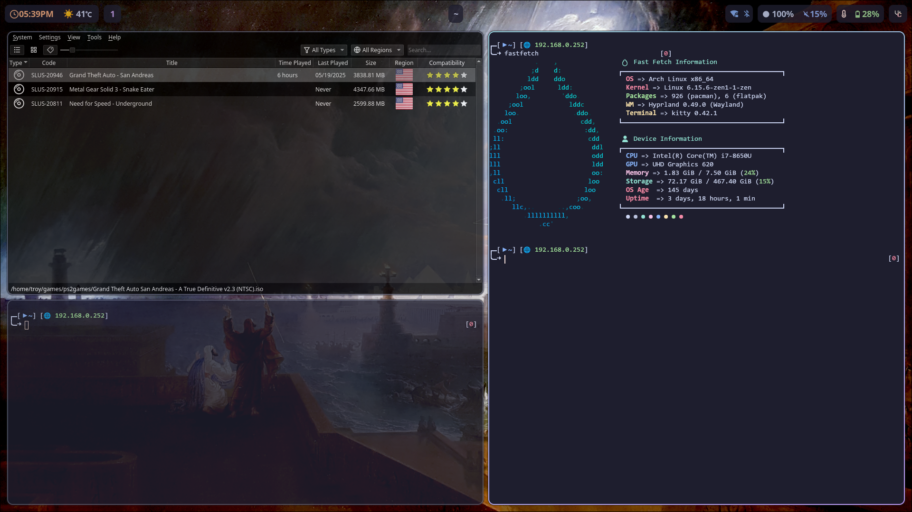

# Preface

This configuration for hyprland+arch was created for a Lenovo Thinkpad T480S laptop.
I 100% guarantee something will break when using any non-intended devices or your money back!

# Installation

```
1. Start with a minimal Arch install.
(Only requires networking is set up and git is installed)
(Installer will detect if Yay must be installed when ran)
2. make a `~/git` folder or similar to clone this repo then use `chown -R ~/git/hyprland` to assign your user permissions.
3. run `~/git/hyprland/set-hypr` and follow install.
(while setting the terminal to ZSH, you must type `exit` afterwards to continue the install)
4. It will ask to launch. Either A:say 'y' to launch or, B: say 'n' and type `Hyprland` into console or, C: restart pc and it will boot into the greeter
5. Enjoy
```

# Post Installation

Beware that I disable the SD Card reader, as recommended to save power.
To re-enable SD Card: `sudo echo 2-3 > sudo sys/bus/usb/drivers/usb/bind`
Modify this to your heart's content!


Notable places to configure things:
`~/.config/hypr/*`
`~/.config/hypr/hyprland/*`
`~/.oh-my-zsh`
`/etc/*`



# Notable things which get installed

Apps:

(for windows users: "SUPER" means the windows key:)
```
Tofi(App launcher) [SUPER+R]
Kitty(Terminal) [SUPER+Enter]
Vesktop(Discord) [App Launcher]
Pureref(Image References) [App Launcher]
Nemo(File Manager) [App Launcher]
Btop(Task Manager) [Terminal]
```

Background Apps:

```
SwayNc(desktop notifications)
Waybar(top status bar)
Hyprlock/HyperIdle(lockscreen + idlelocker)
Network Manager(click wifi icon in Waybar)
Bluetooth Manager(click bluetooth icon in Waybar)
```

Daemons:
```

tlp (Battery Manager)
Bluetooth
Throttled (DeThrottler)
Reflector (Pacman Mirrorlist Auto Update)
Greetd (Greeter)

```

# Notable Keybinds

General:
```

SUPER + R -> App Launcher
SUPER + Enter -> Terminal
SUPER + S -> Opens special workspace
SUPER + Shift + S -> Moves window into special workspace
SUPER + 1-0 -> Goes to each workspace
SUPER + Shift + 1-0 -> Moves window into specified workspace number
```


Pre-Scripted Control Keys:
```

Printscreen copies to clipboard
Media Controls
Volume/Mute Controls
Brightness Controls
Keyboard Backlight
Favorites Key (star icon) opens notifications

```


