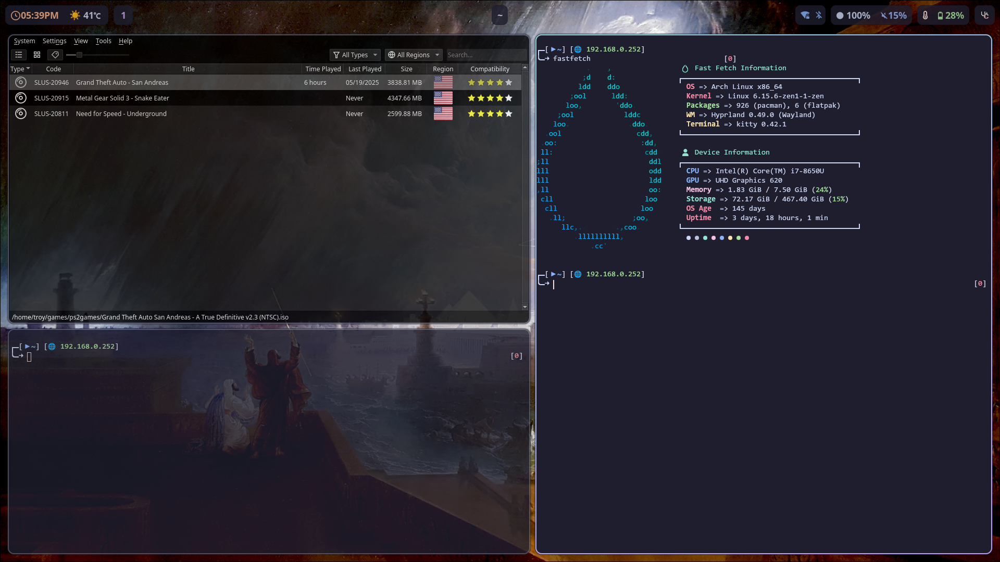

# Hyprland Dotfiles

> ⚠️ This config requires **Arch Linux** on a **Lenovo ThinkPad T480s**. Other devices are untested, and never will be developed by me within this repo.

### Desktop Preview



## Installation

1. Start with a minimal `archinstall`, install yay on it  (https://wiki.archlinux.org/title/AUR_helpers)
2. Git clone this repo, chown this repo, and run the `set-hypr` script.
3. Follow the prompts, then launch and/or reboot.

The `set-hypr` script: 
checks for yay, ensures all files are chowned, installs dependencies and essential packages,
(optional) installs from the custom package list,
(optional) sets shell to ZSH,
copies config files, disables SD reader, enables system services, updates grub config,
sets general settings and then starts GreetD, from there you can log into Hyprland.

## Essential Packages

The `set-hypr` script installs all packages automatically, but these are the core packages worth knowing about - they make up the base system and are referenced elsewhere in this README.

### Hyprland Core

| Package | Purpose |
|---|---|
| `hyprland` | Window manager / compositor |
| `xdg-desktop-portal-hyprland` | Desktop portal (screen share, file pickers) |
| `xdg-desktop-portal-gtk` | GTK portal backend |
| `polkit-gnome` | Authentication agent |
| `qt5-wayland` / `qt6-wayland` | Native Wayland support for Qt apps |
| `hyprlock` | Lockscreen |
| `hypridle` | Idle manager |
| `hyprpaper` | Wallpaper daemon |
| `waybar` | Status bar |
| `rofi` | App launcher |
| `swaync` | Notification daemon |

### Session & Shell

| Package | Purpose |
|---|---|
| `greetd` / `greetd-tuigreet` | Login manager |
| `kitty` | Terminal |
| `zsh` | Shell |
| `neovim` | Editor (bound to `F9`) |

### Graphics (Intel, T480s-specific)

| Package | Purpose |
|---|---|
| `mesa` / `lib32-mesa` | Graphics drivers |
| `vulkan-intel` / `lib32-vulkan-intel` | Vulkan support for Intel iGPU |

### Audio

| Package | Purpose |
|---|---|
| `pipewire` / `pipewire-pulse` / `lib32-pipewire` | Audio server |
| `wireplumber` | Session manager |
| `pavucontrol` | Volume control GUI |
| `pamixer` | CLI volume control |
| `playerctl` | Media key controls |

### Power (T480s-specific)

| Package | Purpose |
|---|---|
| `tlp` / `tlpui` | Battery/power management |
| `throttled` | Fixes Intel CPU throttling bug |
| `brightnessctl` | Screen brightness control |

### Networking & Bluetooth

| Package | Purpose |
|---|---|
| `networkmanager` / `network-manager-applet` | Network management |
| `bluez` / `bluez-utils` | Bluetooth stack |

### File Management

| Package | Purpose |
|---|---|
| `nemo` | File browser |
| `gvfs` / `gvfs-mtp` | Filesystem access (network shares, phones) |

### Fonts & Icons

| Package | Purpose |
|---|---|
| `noto-fonts` (+ `-cjk`, `-emoji`, `-extra`) | Font coverage |
| `ttf-nerd-fonts-symbols` | Icon glyphs (used in Waybar) |
| `papirus-icon-theme` | Icon theme |

### Custom Packages

**I highly recommend you read ./packages/custompackages.txt to add/remove software you do not want.**

Beyond the essentials, the repo also installs packages of my personal preference (extra CLI tools, PureRef, WPS Office, Steam, spotify, Prismlauncher, etc.). These aren't required for the config to function - feel free to skip installing them in the `set-hypr` script and/or edit the list to suit your own setup then run `set-hypr` to install those packages you want. Or just learn to use yay like a sensible person. 

Yes, Firefox is a dependancy, and not listed in `custompackages.txt` because I wouldn't want someone unfamiliar with the terminal to be stuck without a web browser after they remove them all.

They're defined separately in:
```
./packages/custompackages.txt
```

## Post-Install

### SD Card Reader

The SD card reader is disabled by default to save power.

**Enable:**
```bash
echo "2-3" | sudo tee /sys/bus/usb/drivers/usb/bind
```

**Disable:**
```bash
echo "2-3" | sudo tee /sys/bus/usb/drivers/usb/unbind
```
( will be changed to be more intuitive soon )

### Startup Scripts

On launch, Hyprland runs `~/.config/hypr/scripts/open_reminders`, a small notekeeping/reminders script. It reads from and writes to:
```
~/Documents/reminder.txt
```
Edit or clear that file directly to manage your reminders.

### Screenshots

Screenshots (bound to the `Print` key) are automatically copied to your clipboard **and** saved to:
```
~/Documents/screenshots/
```

## Default Applications

### User Software

| Application    | Purpose               | Launch                                   |
|-----------------|------------------------|-------------------------------------------|
| Rofi            | App launcher           | `SUPER + R`                               |
| Kitty           | Terminal               | `SUPER + Enter`                           |
| Waybar          | Status bar             | `SUPER + T`                               |
| Waybar Tray     | Software tray          | Appears on Waybar                         |
| Firefox         | Browser                | Rofi                                      |
| Thorium         | Chromium browser       | Rofi                                      |
| Vesktop         | Discord client         | Rofi                                      |
| Btop++          | Task manager           | Rofi                                      |
| Nemo            | File browser           | Rofi                                      |
| WPS Office      | Office suite            | Rofi                                      |
| PureRef         | Image references        | Rofi                                      |
| GoCryptFS       | Encrypted drive manager | Rofi                                      |
| TLP UI          | Power settings          | Rofi / power icon                         |
| PAVUC           | Volume control           | Click Waybar audio icon                   |
| Network Manager | Network manager          | Click Waybar Wi-Fi icon → tray            |
| Blueman         | Bluetooth manager        | Rofi / click Waybar Bluetooth icon → tray |

### Daemons

| Daemon         | Role                    |
|-----------------|--------------------------|
| Greetd          | Login manager             |
| Hyprlock        | Lockscreen                |
| Hypridle        | Idle manager              |
| SwayNC          | Desktop notifications     |
| Reflector       | Pacman mirrorlist updater |
| TLP             | Battery manager           |
| Bluez           | Bluetooth                 |
| Throttled       | CPU dethrottler           |
| Pipewire-Pulse  | Audio                     |

## Keybindings

> All keybinds below are defined in `~/.config/hypr/settings/keybinds.lua`. That file - along with everything else in `~/.config/hypr/settings/` - is fair game to edit. Rebind, remove, or add whatever you like; nothing here is fixed. This repo is meant to be forked, cloned, and bent to your own setup, so make it yours.

### Hyprland

| Keybind                | Action                              |
|--------------------------|---------------------------------------|
| `SUPER + R`               | Rofi app launcher                     |
| `SUPER + Enter`           | Open Kitty terminal                   |
| `SUPER + F`               | Fullscreen                            |
| `SUPER + C`               | Close window                          |
| `SUPER + V`               | Toggle floating window                |
| `SUPER + P`               | Pseudotiling                          |
| `SUPER + ESCAPE`          | Exit Hyprland                         |
| `SUPER + ← / → / ↑ / ↓`   | Move focus between windows            |
| `SUPER + Left Click drag` | Drag/move a floating window           |
| `SUPER + Right Click drag`| Resize a window                       |
| `SUPER + 1–0`             | Switch to workspaces 1–10             |
| `SUPER + SHIFT + 1–0`     | Move window to workspaces 1–10*       |
| `SUPER + S`               | Toggle special workspace              |
| `SUPER + SHIFT + S`       | Move window to special workspace      |
| `SUPER + W`               | Wallpaper picker                      |
| `SUPER + I`               | Toggle hypridle (idle manager)        |
| `SUPER + B`               | Toggle box blur shader                |
| `SUPER + N`               | Toggle pixelate shader                |
| `SUPER + T`               | Toggle Waybar                         |

\* Note: `SUPER + SHIFT + 0` currently sends the window to workspace **1**, not 10 - this is preserved as-is from the original config. Edit `keybinds.lua` if you'd rather it map to workspace 10.

### Scripted / Function Keys

| Key(s)          | Action                          |
|------------------|-----------------------------------|
| `Print`          | Screenshot (copied to clipboard + saved to `~/Documents/screenshots/`) |
| `F1–F4`          | Volume / mute controls            |
| `F5–F6`          | Brightness controls               |
| `F7`             | Open nwg-displays                 |
| `F8`             | Network killswitch                |
| `F9`             | Open Neovim inside `~/.config`    |
| `F10`            | Bluetooth killswitch              |
| `F11`            | Keyboard backlight                |
| `F12`            | Notifications                     |
| `Ctrl + →`       | Next song                         |
| `Ctrl + ←`       | Previous song                     |
| `Ctrl + ↑`       | Play                              |
| `Ctrl + ↓`       | Pause                             |

## Make It Your Own!!!

This is a personal config shared for others to learn from or build on - not a prescriptive setup. This was made from scratch with EXTREME AMOUNTS of trial and error. I have been painstakingly making this for a few years, and it has been broken and reforged may times.

Clone it, strip it down, bolt on your own scripts, swap the wallpaper daemon, change every keybind - whatever suits your workflow. Everything, at the end of the day, is a matter of opinion so don't limit yourself to mine.

The most immediate and important things to change would be within `~/.config` `~/.config/hypr`, but especially `~/.config/hypr/settings`. Add/remove wallpapers at `~/.config/hypr/wallpapers`. 

For hyprland configuration, do not be afraid of LUA, it is an intuitive language, and you can always ask AI to make changes you want to keybinds, autolaunch, etc within `~/.config/hypr/settings`

YOU ARE FREE TO BRICK YOUR SYSTEM JUST AS THE FOUNDING FATHERS INTENDED :)
